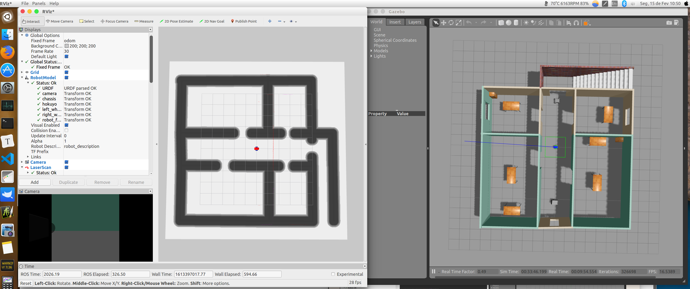
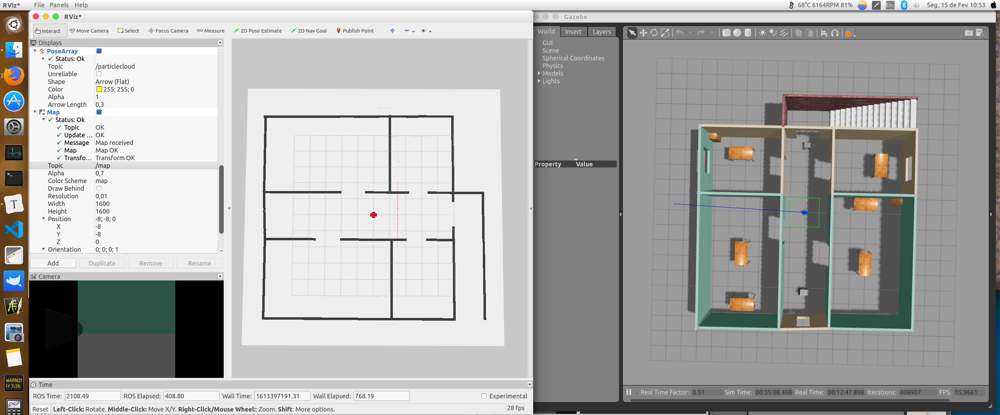
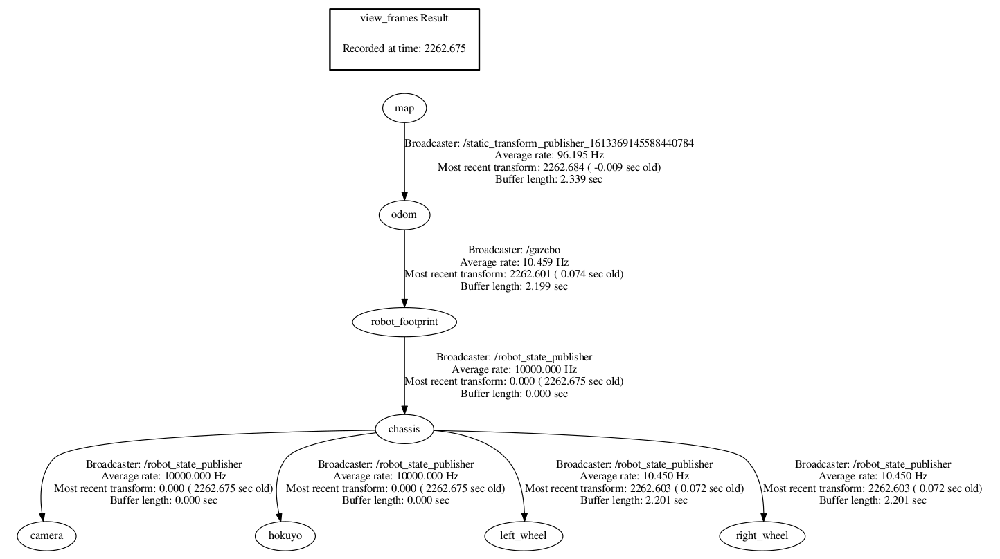

# Attempt #3 15.02.2021

**Terminal 1:** launching robot + world main package

```bash
fpassold@18:~/workspace_project3/catkin_ws$ source devel/setup.bash
fpassold@18:~/workspace_project3/catkin_ws$ roslaunch my_robot world.launch
```

Note: at RViz, Global Options >> Fixed Frame: odom.

**Terinal 2:** launching AMCL package on the robot.

```bash
fpassold@19:~/workspace_project3/catkin_ws$ source devel/setup.bash
fpassold@19:~/workspace_project3/catkin_ws$ roslaunch my_robot amcl.launch
```

Initial messages:

```bash
[ INFO] [1613396539.251613138, 1772.043000000]: Requesting the map...
[ WARN] [1613396539.256748865, 1772.047000000]: Request for map failed; trying again...
[ INFO] [1613396540.386608771, 1772.560000000]: Received a 1600 X 1600 map @ 0.010 m/pix

[ WARN] [1613396540.387186180, 1772.560000000]: Frame_id of map received:'/map' doesn't match global_frame_id:'map'. This could cause issues with reading published topics
[ INFO] [1613396540.751761141, 1772.740000000]: Initializing likelihood field model; this can take some time on large maps...
[ INFO] [1613396544.512671570, 1774.438000000]: Done initializing likelihood field model.
[ WARN] [1613396549.662279533, 1777.077000000]: Timed out waiting for transform from robot_footprint to map to become available before running costmap, tf error: canTransform: target_frame map does not exist.. canTransform returned after 0.1 timeout was 0.1.
[ WARN] [1613396556.576561745, 1782.084000000]: Timed out waiting for transform from robot_footprint to map to become available before running costmap, tf error: canTransform: target_frame map does not exist.. canTransform returned after 0.1 timeout was 0.1.
[ WARN] [1613396561.820136801, 1787.094000000]: Timed out waiting for transform from robot_footprint to map to become available before running costmap, tf error: canTransform: target_frame map does not exist.. canTransform returned after 0.1 timeout was 0.1.
[ WARN] [1613396564.442523210, 1789.606000000]: No laser scan received (and thus no pose updates have been published) for 1789.606000 seconds.  Verify that data is being published on the /my_robot/laser/scan topic.

```


**Terminal 3**: fixing RViz problem: without connection /odon -> /map; and message: Map >> Message: No map received,with Topic: /move_base/global_costmap/costmap. 

```bash
fpassold@20:~/workspace_project3/catkin_ws$ source devel/setup.bash
fpassold@20:~/workspace_project3/catkin_ws$ rosrun tf static_transform_publisher 0 0 0 0 0 0 1 map odom 10
```

After a few seconds, in the terminal 2 window appears:

```xml
[ INFO] [1613369146.020559772, 1815.114000000]: Loading from pre-hydro parameter style
[ INFO] [1613369146.162568779, 1815.171000000]: Using plugin "static_layer"
[ INFO] [1613369146.198456931, 1815.186000000]: Requesting the map...
[ INFO] [1613369146.400889462, 1815.298000000]: Resizing costmap to 1600 X 1600 at 0.010000 m/pix
[ INFO] [1613369146.616695447, 1815.398000000]: Received a 1600 X 1600 map at 0.010000 m/pix
[ INFO] [1613369146.649906014, 1815.406000000]: Using plugin "obstacle_layer"
[ INFO] [1613369146.670224798, 1815.413000000]:     Subscribed to Topics: laser_scan_sensor
[ INFO] [1613369146.829639216, 1815.479000000]: Using plugin "inflation_layer"
[ INFO] [1613369147.208513733, 1815.595000000]: Loading from pre-hydro parameter style
[ INFO] [1613369147.337360614, 1815.644000000]: Using plugin "obstacle_layer"
[ INFO] [1613369147.360651131, 1815.655000000]:     Subscribed to Topics: laser_scan_sensor
[ INFO] [1613369147.512820006, 1815.708000000]: Using plugin "inflation_layer"
[ INFO] [1613369147.821599418, 1815.839000000]: Created local_planner base_local_planner/TrajectoryPlannerROS
[ INFO] [1613369147.884518601, 1815.861000000]: Sim period is set to 0.10
[ WARN] [1613369147.919732999, 1815.871000000]: No laser scan received (and thus no pose updates have been published) for 1815.871000 seconds.  Verify that data is being published on the /my_robot/laser/scan topic.
[ WARN] [1613369147.937216150, 1815.879000000]: Trajectory Rollout planner initialized with param meter_scoring not set. Set it to true to make your settins robust against changes of costmap resolution.
[ INFO] [1613369148.766238762, 1816.215000000]: Recovery behavior will clear layer obstacles
[ INFO] [1613369148.797024999, 1816.227000000]: Recovery behavior will clear layer obstacles
[ INFO] [1613369149.066966233, 1816.322000000]: odom received!
```

And in RViz >> Display >> Map >> Topic: /move_base/global_costmap/costmap - now works without problems (except for the map rotated by -90 degrees):



More results

a) Notice the RViz --> if: Map >> topic chaged to: /map it turns to:



Note `map.yaml` file:

```yaml
image: map.pgm
resolution: 0.01
origin: [-8.0, -8.0, 0.0]
occupied_thresh: 0.65
free_thresh: 0.196
negate: 0
```

**Still problems**

But the problem of "/scan" still persists: in terminal 2 (where the AMCL node was launched), appears:

```bash
[ WARN] [1613397248.837522035, 2134.605000000]: No laser scan received (and thus no pose updates have been published) for 2134.605000 seconds.  Verify that data is being published on the /my_robot/laser/scan topic.
```

## Trying to make diagnoses:

Using **roswtf**:

```bash
fpassold@2:~/workspace_project3/catkin_ws$ roswtf
Loaded plugin tf.tfwtf
...
Found 2 warning(s).
Warnings are things that may be just fine, but are sometimes at fault

WARNING The following node subscriptions are unconnected:
 * /amcl:
   * /my_robot/laser/scan
 * /move_base:
   * /my_robot/laser/scan
   * /move_base/cancel
 * /gazebo:
   * /gazebo/set_link_state
   * /gazebo/set_model_state

WARNING These nodes have died:
 * urdf_spawner-6


Found 1 error(s).

ERROR The following nodes should be connected but aren't:
 * /move_base->/move_base (/move_base/global_costmap/footprint)
 * /move_base->/move_base (/move_base/local_costmap/footprint)

fpassold@2:~/workspace_project3/catkin_ws$ 
```

Note `amcl.launcg` file:

```xml
<launch>
  <!-- 6) Map Server Node 1 `name="map_server"`; -->
  <!-- O nó map_server fornece dados de mapa como um serviço ROS para outros nós, como o nó amcl. 
       Aqui, o nó map_server localizará o mapa que você criou na etapa Map Setup 
       e o enviará como os dados do mapa. -->
  <!-- First, add an argument of the path to your map file -->
  <!-- <arg name="map_file" default="$(find <YOUR PACKAGE NAME>)/maps/<YOUR MAP NAME>.yaml"/> -->
  <arg name="map_file" default="$(find my_robot)/maps/map.yaml"/>
  <!-- Then, add the `map_server` node, which utilizes the argument you created just now: -->
  <!-- <node name="map_server" pkg="map_server" type="map_server" args="$(arg map_file)" /> -->
  <node name="map_server" pkg="map_server" type="map_server" args="$(arg map_file)">
    <param name="frame_id" value="/map"/> 
  </node>

  <!-- 7) AMCL Node `name="amcl"`; -->
  <!-- AMCL Node -->
  <node name="amcl" pkg="amcl" type="amcl" output="screen">
    <!-- <remap from="scan" to="<YOUR PACKAGE NAME>/laser/scan"/> -->
    <!-- what are the sensor readings from the LiDAR? -->
    <remap from="scan" to="my_robot/laser/scan"/>
    <!--  parameters in order to connect the world (`map` frame) with the robot (`odom` frame). -->
    <param name="odom_frame_id" value="odom"/>
    <param name="odom_model_type" value="diff-corrected"/>
    <param name="base_frame_id" value="robot_footprint"/>
    <param name="global_frame_id" value="map"/>
    <!-- Lembre-se de que o pacote AMCL 'liga' o robô (frame `odom`) ao mundo (frame `map`) !?
         Esses parâmetros são necessários para o pacote amcl localizar o robô no mundo.-->
    <!-- Optional: Set Initial Position -->
    <param name="initial_pose_x" value="0"/>
    <param name="initial_pose_y" value="0"/>
  </node>

  <!--8) Move Base Node `name="move_base"` -->
  <node name="move_base" pkg="move_base" type="move_base" respawn="false" output="screen">
    <!-- Again, we need to `remap` the `scan` topic to the correct one. -->
    <remap from="scan" to="my_robot/laser/scan"/>
    <!-- Adding Parameters to `move_base` (robot) in the world Node -->
    <!--  when there are plenty of parameters, we could use the rosparam tag to include config files to set multiple parameters directly!  -->
    <!-- Planners: -->  
    <param name="base_global_planner" value="navfn/NavfnROS" />
    <param name="base_local_planner" value="base_local_planner/TrajectoryPlannerROS"/>
    <!-- Config files, em outra pasta! -->
    <rosparam file="$(find my_robot)/config/costmap_common_params.yaml" command="load" ns="global_costmap" />
    <rosparam file="$(find my_robot)/config/costmap_common_params.yaml" command="load" ns="local_costmap" />
    <rosparam file="$(find my_robot)/config/local_costmap_params.yaml" command="load" />
    <rosparam file="$(find my_robot)/config/global_costmap_params.yaml" command="load" />
    <rosparam file="$(find my_robot)/config/base_local_planner_params.yaml" command="load" />
  </node>

</launch>
```


Performing other diagnostics:

```bash
fpassold@2:~/workspace_project3/catkin_ws$ rostopic info /scan
Type: sensor_msgs/LaserScan

Publishers: 
 * /gazebo (http://fpassold-Ubuntu16:37563/)

Subscribers: 
 * /rviz (http://fpassold-Ubuntu16:42955/)


fpassold@2:~/workspace_project3/catkin_ws$
```

Another:

```bash
fpassold@2:~/workspace_project3/catkin_ws$ rosnode info amcl
--------------------------------------------------------------------------------
Node [/amcl]
Publications: 
 * /amcl/parameter_descriptions [dynamic_reconfigure/ConfigDescription]
 * /amcl/parameter_updates [dynamic_reconfigure/Config]
 * /amcl_pose [geometry_msgs/PoseWithCovarianceStamped]
 * /particlecloud [geometry_msgs/PoseArray]
 * /rosout [rosgraph_msgs/Log]
 * /tf [tf2_msgs/TFMessage]

Subscriptions: 
 * /clock [rosgraph_msgs/Clock]
 * /initialpose [geometry_msgs/PoseWithCovarianceStamped]
 * /my_robot/laser/scan [unknown type]
 * /tf [tf2_msgs/TFMessage]
 * /tf_static [tf2_msgs/TFMessage]

Services: 
 * /amcl/get_loggers
 * /amcl/set_logger_level
 * /amcl/set_parameters
 * /global_localization
 * /request_nomotion_update
 * /set_map


contacting node http://fpassold-Ubuntu16:36167/ ...
Pid: 19775
Connections:
 * topic: /rosout
    * to: /rosout
    * direction: outbound
    * transport: TCPROS
 * topic: /tf
    * to: /amcl
    * direction: outbound
    * transport: INTRAPROCESS
 * topic: /tf
    * to: /rviz
    * direction: outbound
    * transport: TCPROS
 * topic: /tf
    * to: /move_base
    * direction: outbound
    * transport: TCPROS
 * topic: /particlecloud
    * to: /rviz
    * direction: outbound
    * transport: TCPROS
 * topic: /clock
    * to: /gazebo (http://fpassold-Ubuntu16:37563/)
    * direction: inbound
    * transport: TCPROS
 * topic: /tf
    * to: /amcl (http://fpassold-Ubuntu16:36167/)
    * direction: inbound
    * transport: INTRAPROCESS
 * topic: /tf
    * to: /robot_state_publisher (http://fpassold-Ubuntu16:37209/)
    * direction: inbound
    * transport: TCPROS
 * topic: /tf
    * to: /gazebo (http://fpassold-Ubuntu16:37563/)
    * direction: inbound
    * transport: TCPROS
 * topic: /tf
    * to: /static_transform_publisher_1613369145588440784 (http://fpassold-Ubuntu16:35271/)
    * direction: inbound
    * transport: TCPROS
 * topic: /tf_static
    * to: /robot_state_publisher (http://fpassold-Ubuntu16:37209/)
    * direction: inbound
    * transport: TCPROS
 * topic: /initialpose
    * to: /rviz (http://fpassold-Ubuntu16:42955/)
    * direction: inbound
    * transport: TCPROS

fpassold@2:~/workspace_project3/catkin_ws$ 
```

Note: " * /my_robot/laser/scan [unknown type]" !?

Another test: LiDAR are scanning?

```bash
fpassold@2:~/workspace_project3/catkin_ws$ rostopic echo -n 1 /scan
header: 
  seq: 17689
  stamp: 
    secs: 2222
    nsecs: 395000000
  frame_id: "hokuyo"
angle_min: -1.57079994678
angle_max: 1.57079994678
angle_increment: 0.00436940183863
time_increment: 0.0
scan_time: 0.0
range_min: 0.10000000149
range_max: 30.0
ranges: [5.002425193786621, 4.998050689697266, 5.012252330780029, 4.995103359222412, 4.997104167938232, 4.9996337890625, 4.998635768890381, 5.030695915222168, 6.6881632804870605, 6.705824375152588, 6.6974358558654785, 6.6849446296691895, 6.688786029815674, 6.692741870880127, 6.69281530380249, 6.683964252471924, 6.697765827178955, 6.684508323669434, 6.704347610473633, 6.6921916007995605, 6.6806817054748535, 6.6959710121154785, 6.712215900421143, 6.70830774307251, 6.69977331161499, 6.6911420822143555, 6.691666603088379, 6.701845645904541, 6.703311443328857, 6.705527305603027, 6.730433940887451, 6.737390995025635, 6.720254898071289, 6.73766565322876, 6.7262773513793945, 6.730212211608887
...
2.7896610380580046e-37, 2.7896610380580046e-37, 2.7896610380580046e-37, 2.7896610380580046e-37, 2.7896610380580046e-37, 2.7896610380580046e-37, 2.7896610380580046e-37, 2.7896610380580046e-37, 2.7896610380580046e-37, 2.7896610380580046e-37, 2.7896610380580046e-37, 2.7896610380580046e-37, 2.7896610380580046e-37, 2.7896610380580046e-37, 2.7896610380580046e-37, 2.7896610380580046e-37, 2.7896610380580046e-37, 2.7896610380580046e-37, 0.0, 0.0, 0.0, 0.0, 0.0, 0.0, 0.0, 0.0, 0.0, 0.0, 0.0, 0.0, 0.0, 0.0, 0.0, 0.0, 0.0, 0.0, 0.0, 0.0, 0.0, 0.0, 0.0, 0.0, 0.0, 0.0, 0.0, 0.0, 0.0, 0.0, 0.0, 0.0]
---
fpassold@2:~/workspace_project3/catkin_ws$
```

**Note:** it looks like the laser sensor is working and publishing but in the "hokuyo" frame <- was this supposed to be like this?

Observing the chaining between frames:

```bash
fpassold@2:~/workspace_project3/catkin_ws$ rosrun tf view_frames
Listening to /tf for 5.000000 seconds
Done Listening
dot - graphviz version 2.38.0 (20140413.2041)

Detected dot version 2.38
frames.pdf generated
fpassold@2:~/workspace_project3/catkin_ws$
```

It is noticed that the connection between frama / map and / odom is ok. Was the rest supposed to be like this?

Resulting file: `frames.pdf`:



More tests:

```bash
fpassold@2:~/workspace_project3/catkin_ws$ rostopic info /tf
Type: tf2_msgs/TFMessage

Publishers: 
 * /robot_state_publisher (http://fpassold-Ubuntu16:37209/)
 * /gazebo (http://fpassold-Ubuntu16:37563/)
 * /amcl (http://fpassold-Ubuntu16:36167/)
 * /static_transform_publisher_1613369145588440784 (http://fpassold-Ubuntu16:35271/)

Subscribers: 
 * /rviz (http://fpassold-Ubuntu16:42955/)
 * /move_base (http://fpassold-Ubuntu16:41783/)
 * /amcl (http://fpassold-Ubuntu16:36167/)


fpassold@2:~/workspace_project3/catkin_ws$ 
```

Testing a possibility:

```bash
fpassold@2:~/workspace_project3/catkin_ws$ rostopic echo /base_scan
WARNING: topic [/base_scan] does not appear to be published yet
^Cfpassold@2:~/workspace_project3/catkin_ws$
```

End of tests.

**Additional note**: noticed that changing values of x and y in `map.yaml` only have an effect on RViz >> Map>> Topic: /move_base/global_costmap/costmap and sometimes on Topi: /map. But the angle informed * does not interfere** in anything at RViz (it is irrelevant).

---

Fernando Passold, 15.02.2021 03:45